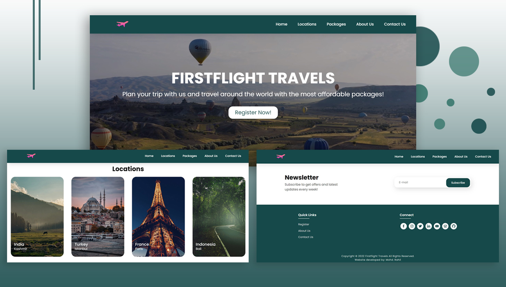

# 🌍 Easy Travel

Easy Travel is a responsive travel website built using **HTML, CSS, and JavaScript**.  
This project helps users explore different travel destinations and provides detailed information about various locations, including attractions, travel experiences, and destination highlights.

---

## 🚀 Features

- 🏠 Attractive Home Page with modern UI
- 📍 Multiple Travel Destination Pages
- 🖼️ Image Gallery for travel locations
- 📖 Detailed location descriptions
- 📞 Contact Page
- ℹ️ About Page
- 📱 Responsive design for desktop and mobile
- 🎥 Background video for enhanced user experience

---

## 🛠️ Technologies Used

- **HTML5** – Structure of the website
- **CSS3** – Styling and layout
- **JavaScript** – Interactive functionality
- **GitHub Pages** – Deployment and hosting

---

## 📂 Project Structure

```bash
easy-travel/
│
├── index.html              # Home page
├── about.html              # About page
├── contact.html            # Contact page
├── locations.html          # Travel locations page
├── register.html          # Registration page
│
├── style.css              # Main styling file
├── script.js              # JavaScript logic
│
├── bgvid.mp4              # Background video
├── logo.png               # Website logo
│
└── images/                # Travel images
```

---

## 🎯 Purpose of Project

The main purpose of this project is to provide users with travel-related information in a simple and visually attractive way. Users can browse various tourist destinations and get details to plan their travel better.

This project was created to improve frontend development skills and gain practical experience in building responsive websites.

---

## 💡 Learning Outcomes

Through this project, I learned:

- Building complete static websites
- Creating responsive layouts using CSS
- Using JavaScript for interactivity
- Organizing project files properly
- Hosting projects using GitHub Pages

---

## 📸 Screenshots

Add project screenshots here:

- Home Page
- About Page
- Locations Page
- Contact Page

Example:

```markdown

```

---

## 🔧 Installation & Setup

To run this project locally:

1. Clone the repository

```bash
git clone https://github.com/your-username/easy-travel.git
```

2. Open project folder

```bash
cd easy-travel
```

3. Open `index.html` in browser

---

## 🌐 Live Demo

GitHub Pages Deployment:

Add your live project link here.

Example:

```text
https://yourusername.github.io/easy-travel/
```

---

## 👨‍💻 Author

**Saurabh Tiwari**  
MCA Graduate | MERN Stack Developer  
Passionate about Web Development and Software Engineering

GitHub: https://github.com/deadshotsaurab

---

## 📜 License

This project is open-source and available for learning and educational purposes.

---

⭐ If you like this project, consider giving it a star on GitHub.
